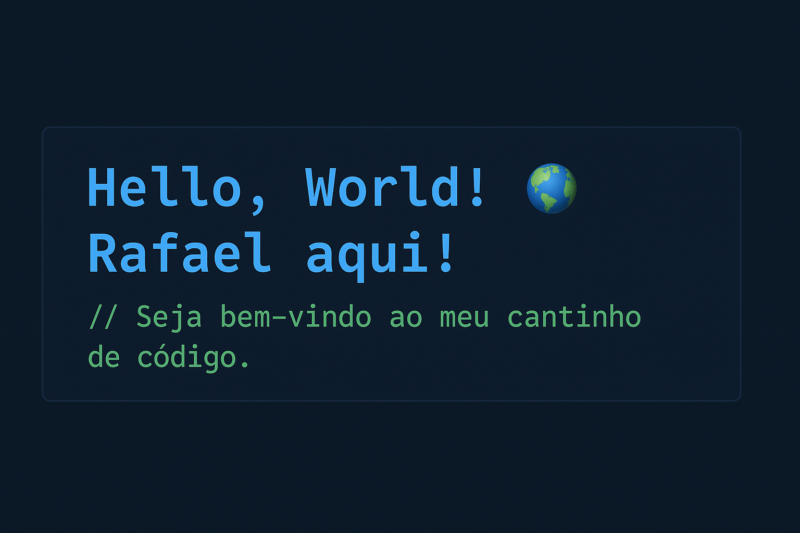

 

 
- 🌱 Aprendendo JavaScript, NodeJS e React
- 👯 Aberto a projetos que desafiem minhas habilidades
- 🤔 Buscando orientação em backend e integração de APIs
- 💬 Posso conversar sobre programação, web e tecnologia
- 📫 Linkedin: (www.linkedin.com/in/rafael-francisco17) 
- ⚡ Curiosidade: Gosto de resolver problemas e experimentar novas ferramentas

<a href="https://github.com/rafael-santos-devv">

          

_________________________________________________________________________________________

_________________________________________________________________________________________

  

🚧 README em construção🚧

>>>>>>> 83f235c (Atualizando README melhorando badges)
